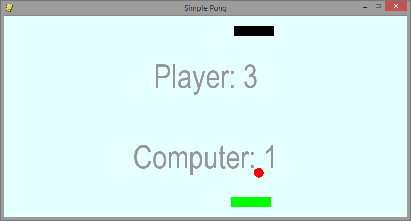

# pong

Klasyczna gra w odbijanie piłeczki zrealizowana z użyciem biblioteki [PyGame](http://www.pygame.org/wiki/tutorials). 

Wersja obiektowa do [materiałów edukacyjnych programu Koduj z Klasą](http://python101.readthedocs.org/pl/latest/pygame/pong/index.html).
 

